**LLM: Qwen3 8B**

**NLP Embedding Model: blair-roberta-base**

# Shopping Copilot — Architecture Diagram, Revision 10

Builds on Revision 9. Adds the two `CLARIFY` waste patterns identified while walking through
whether MTTC’s “penalize unnecessary conversational cognitive load” language was actually
handled: re-asking about an attribute that’s already known or already came back empty, and
failing to act on the boundary scenario’s explicit “no preference” signal. Both fixes
consolidate into `STATE` and `REALIGN` — the two places that already existed to hold exactly
this kind of information.

## Summary of changes from Revision 9

1. **`STATE` gains `asked_attributes`** — every attribute `CLARIFY` has asked about this
session, whether it came back with something or came back empty. Combined with whatever
`STATE` already knows (a slot with a real value needs no further asking either), this is
the exclusion list `CLARIFY` now has to respect.
2. **`PROMPT` gains a fifth output field: `no_preference_signal`.** Rides on the same combined
Stage 2 call, zero extra latency, same discipline as every other signal in this design.
Deliberately NOT a regex on the local evaluator’s exact wording — that phrase is a
fallback-script artifact, and the real private simulator is described as producing varied
natural language. An LLM reading the raw turn is the right tool for recognizing “the user
declined to answer,” however it’s phrased.
3. **New node `NOPREF`** — routes the signal two ways, one hard and one soft. Hard: the
attribute that was asked immediately joins `asked_attributes`, no exceptions. Soft: raises
`REALIGN`’s bar for asking about anything *else* this session — but does not ban
clarification outright, because the real evaluator’s own `boundary_used` logic only
special-cases the *first* ask; every ask after that can still surface a genuine constraint.
4. **`CLARIFY`’s candidate set is now `ALLOWED_ATTRIBUTES` minus known-slots minus
`asked_attributes`.** If that set is empty, there’s nothing left worth asking regardless of
what `SPREAD` says.
5. **`REALIGN` absorbs this as a third input**, alongside turn-budget and active strategy —
it was already the single gatekeeper deciding whether `CLARIFY` fires, so attribute
exhaustion and the no-preference soft signal slot into a role that already existed, rather
than needing a new one.

## Diagram

```mermaid
graph TD
    %% ===== Slot schema specification =====
    SCHEMA["Slot schema — profiled against the real 50k catalog<br/><br/>MACRO TIER (drives CATCMP / global reset):<br/>• category — leaf node (categories[-1]), depth-invariant<br/><br/>MICRO TIER — reliable structured filter:<br/>• department — 87.2% coverage, MUST lowercase first<br/>• store — 99.4% coverage, better brand proxy than details.Brand<br/><br/>MICRO TIER — text-matched, NOT structure-filterable:<br/>• color, size, material, brand, style<br/>• price_band — range; soft score ONLY, never a hard filter"]

    %% ===== Stage 1 : Context Formatting =====
    subgraph STAGE1["Stage 1 · Context Formatting"]
        RAW["Raw conversation JSON<br/>category_bucket · scenario_type<br/>user_profile · dialog history"]
        DENOISE["History denoising (dialog-history turns only)<br/>drop turns that don't measurably help retrieval<br/>HAConvDR-style PRJ, rule derived offline<br/>zero extra latency at runtime"]
        MERGE["Template merge"]
        CTX["Conversational context string"]
        RAW --> DENOISE --> MERGE --> CTX
    end

    %% ===== Stage 2 : Combined Generation — NOW FIVE fields, not four =====
    subgraph STAGE2["Stage 2 · Combined Generation (no training)"]
        PROMPT["Few-shot LLM prompt<br/>single combined call<br/>fixed JSON output schema<br/>few-shot examples MUST contrast:<br/>accumulation ('also', 'and', 'in size X')<br/>vs override ('actually', 'instead', 'change that to')<br/>MUST include raw/ungrammatical fragments too —<br/>e.g. 'Material:alloy', not just clean sentences"]
        EXP["Expansion<br/>hypothetical-answer, broad"]
        REW["Rewrite<br/>precise, de-contextualized"]
        SLOTOPS["Slot operations<br/>CARRYOVER / UPDATE / DELETE per slot<br/>fields per SCHEMA node"]
        INTENTFIELD["Intent + confidence<br/>buying vs browsing<br/>native field, same call"]
        NOPREFFIELD["no_preference_signal (bool)<br/>tied to whichever attribute was<br/>asked LAST turn — native field,<br/>NOT a regex on any fixed phrase"]
        PROMPT -->|"expansion field"| EXP
        PROMPT -->|"rewrite field"| REW
        PROMPT -->|"slot_operations field"| SLOTOPS
        PROMPT -->|"intent field"| INTENTFIELD
        PROMPT -->|"no_preference_signal field"| NOPREFFIELD
    end

    SCHEMA -.->|"constrains JSON schema for"| PROMPT
    CTX --> PROMPT

    %% ===== State management: macro + micro =====
    SLOTOPS --> TURN1{"First turn?<br/>no prior state to compare"}
    TURN1 -->|"yes: nothing to erase"| STATE["Refreshed session state<br/><br/>NOW ALSO TRACKS:<br/>asked_attributes — every attribute CLARIFY has<br/>asked this session, answered or empty —<br/>excluded from all future asks this session"]
    TURN1 -->|"no"| CATCMP{"Category changed?<br/>compare leaf category (categories[-1])<br/>vs. stored leaf in session state"}
    CATCMP -->|"yes: hard conflict"| MACRO["Global reset<br/>clear all slots<br/>OPEN QUESTION — see erase_vs_accumulate_comparison.py"]
    CATCMP -->|"no"| STATE
    MACRO --> STATE
    SLOTOPS --> MICRO["Apply per-slot ops directly<br/>CARRYOVER / UPDATE / DELETE"]
    MICRO --> STATE

    %% ===== NEW: no_preference_signal routing =====
    NOPREFFIELD --> NOPREF{"no_preference_signal fired?"}
    NOPREF -->|"yes — HARD: exclude this<br/>attribute permanently"| STATE
    NOPREF -->|"yes — SOFT: raise the bar for<br/>asking anything ELSE this session<br/>(not an absolute ban — a real<br/>constraint can still surface later)"| REALIGN

    %% ===== Intent signal =====
    STATE --> CATFILT["Category filter<br/>from dialog state"]
    CATFILT -->|"filled slot count"| INTENT["Intent signal<br/>buying vs browsing confidence"]
    INTENTFIELD --> INTENT

    %% ===== Retrieval gate =====
    INTENT --> GATE{"Buying confidence<br/>above threshold?"}
    EXP --> BROWSE["Browsing track<br/>dense vector retrieval"]
    GATE -->|"no: ambiguous, run both tracks"| BROWSE
    GATE -.->|"yes: skip dense retrieval"| POOL
    REW --> KW["Buying track<br/>keyword + hard-constraint filter"]
    STATE --> KW

    %% ===== Fusion weights =====
    INTENT -->|"weights, not gates"| FUSION["Fusion / rerank weights<br/>base: offline-calibrated on 200 sessions"]

    %% ===== Merged pool =====
    BROWSE --> POOL["Merged candidate pool<br/>scores min-max normalized per track<br/>top-N truncated per track before fusion"]
    KW --> POOL
    CATFILT --> POOL

    %% ===== Ranking unconditional; clarification additive =====
    POOL --> MAG{"Magnitude check<br/>top-K score above floor?"}
    MAG -->|"no: attempt one revision"| REVISE["LLM revises rewrite/expansion<br/>capped: 1 iteration per turn"]
    MAG -->|"yes — first check, or forced through<br/>after 1 revision regardless of outcome"| RANKLLM["LLM Semantic Ranking<br/>ALWAYS runs once magnitude clears"]
    MAG -->|"yes — first check, or forced through<br/>after 1 revision regardless of outcome"| SPREAD{"Spread check<br/>confidence flat across pool?"}
    REVISE --> BROWSE
    REVISE --> KW

    FUSION --> RANKLLM
    RANKLLM --> TOPK["Top-K ranked items"]
    TOPK --> EVAL(["Hit Rate@K · MRR<br/>vs parent_asin ground truth"])

    %% ===== REALIGN: now THREE inputs deciding clarify or not =====
    SPREAD -->|"flat: ambiguous, many plausible items"| REALIGN
    STATE -.->|"known slots ∪ asked_attributes<br/>= CLARIFY's exclusion list"| REALIGN
    REALIGN{"Strategy realignment — free, no LLM call<br/>THREE inputs now:<br/>1. turn budget (turns_remaining ≤ 2 → suppress)<br/>2. active STRATEGY (aggressive vs sparing)<br/>3. is ALLOWED_ATTRIBUTES minus exclusions<br/>&nbsp;&nbsp;&nbsp;empty? → suppress regardless of SPREAD<br/>&nbsp;&nbsp;&nbsp;also: no_preference_signal raises this bar<br/><br/>STATUS: designed only, zero code, zero test"}
    REALIGN -->|"clarify — passes all three checks"| CLARIFY["Generate clarification prompt<br/>candidate set = ALLOWED_ATTRIBUTES<br/>minus known slots minus asked_attributes<br/>slot choice ALSO weighted by PROFILEBIAS"]
    CLARIFY -.->|"user answers, appended as a new turn"| RAW
    CLARIFY -->|"this attribute is now asked"| STATE

    %% ===== Runtime Adaptation, long-term half =====
    PROFILEBIAS["PROFILEBIAS — use given preference_tags<br/>to bias CLARIFY's slot choice<br/><br/>STATUS: designed only, zero code, zero test"]
    PROFILEBIAS -.-> CLARIFY

    RESETHOOK["Inside reset() — runs once per NEW session<br/>Looks back at the JUST-FINISHED session's<br/>final STATE and turns consumed<br/><br/>STATUS: designed only, zero code, zero test"]
    STATE -.->|"final state of the session just ending"| RESETHOOK

    DISTILL["distill_session_to_profile()<br/>updates: preference_tags, purchase_frequency, summary<br/>does NOT update: average_prior_rating, rating_style<br/><br/>STATUS: designed only, zero code, zero test"]
    RESETHOOK --> DISTILL

    PROFILESTORE["ProfileStore — local JSON file<br/>CANNOT be exercised by the official eval<br/>Validated via a standalone round-trip test<br/><br/>STATUS: designed only, zero code, zero test"]
    DISTILL --> PROFILESTORE

    %% ===== Adaptive Orchestration =====
    POLICYSTATS["_policy_stats — dict on the Agent instance<br/>persists across ALL sessions in one evaluator run<br/><br/>STATUS: designed only, zero code, zero test"]
    RESETHOOK -->|"reward = turns consumed by the strategy<br/>active during the just-finished session"| POLICYSTATS

    STRATEGY["Pick this session's strategy — epsilon-greedy<br/>named strategies: clarify_aggressive / clarify_sparing<br/><br/>STATUS: designed only, zero code, zero test"]
    POLICYSTATS --> STRATEGY
    STRATEGY --> REALIGN

    %% ===== Deferred scope =====
    DEFER["Still genuinely deferred:<br/>• Real multi-user production persistence<br/>(auth, concurrent access, migration) —<br/>correctly out of scope regardless of build<br/>effort, since no version of the isolated-session<br/>eval can ever exercise it"]

    classDef stage fill:#ffe8d6,stroke:#c2660a,color:#7c2d12
    classDef retrieval fill:#d1f5ea,stroke:#0f9d78,color:#065f46
    classDef decision fill:#e9e5ff,stroke:#6d5bd0,color:#3730a3
    classDef defer fill:#f3f4f6,stroke:#9ca3af,color:#374151,stroke-dasharray: 5 5
    classDef spec fill:#fff9db,stroke:#d4a017,color:#7c5e00,stroke-dasharray: 3 3
    classDef designed fill:#fdf0ff,stroke:#a855c7,color:#5b1a70,stroke-dasharray: 3 3

    class RAW,DENOISE,MERGE,CTX,PROMPT,EXP,REW,SLOTOPS,INTENTFIELD,NOPREFFIELD,MACRO,MICRO,REVISE,CLARIFY stage
    class BROWSE,KW,CATFILT,POOL,STATE retrieval
    class TURN1,CATCMP,GATE,MAG,SPREAD,FUSION,RANKLLM,TOPK,EVAL,INTENT,NOPREF decision
    class DEFER defer
    class SCHEMA spec
    class PROFILEBIAS,RESETHOOK,DISTILL,PROFILESTORE,POLICYSTATS,STRATEGY,REALIGN designed
```

Note the two new nodes (`NOPREFFIELD`, `NOPREF`) sit inside the already-established
stage/decision coloring, not the purple “designed only” color — these are Pillar II/MTTC
fixes to `CLARIFY`, not Pillar III work, and they’re specified precisely enough to build now,
unlike the purple nodes.